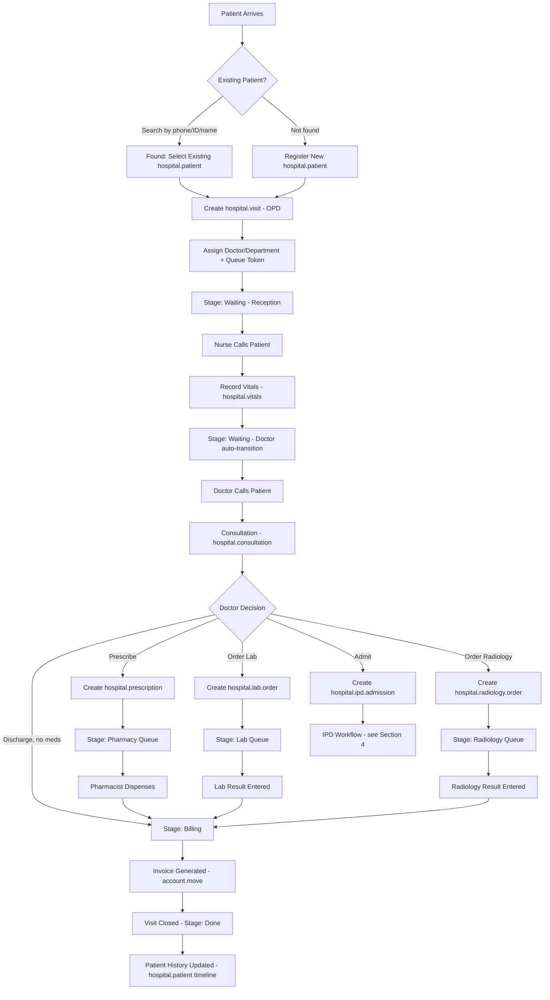
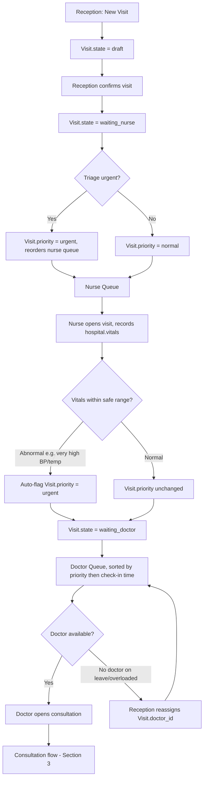
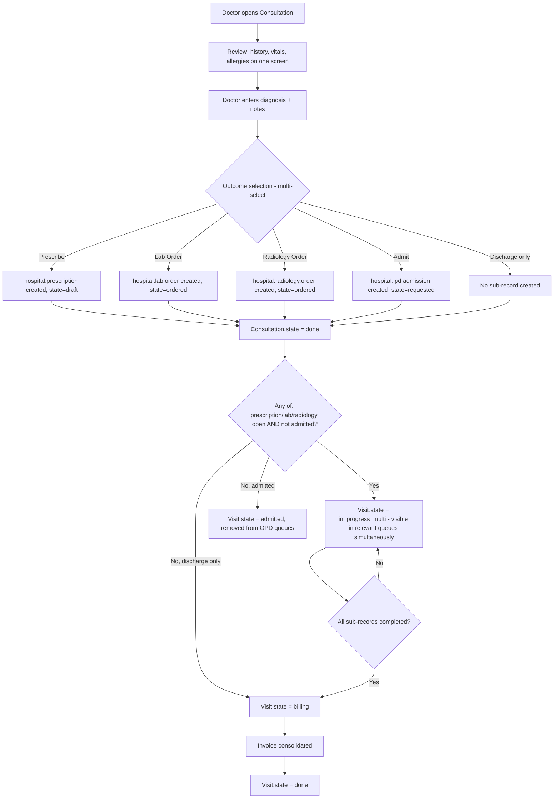
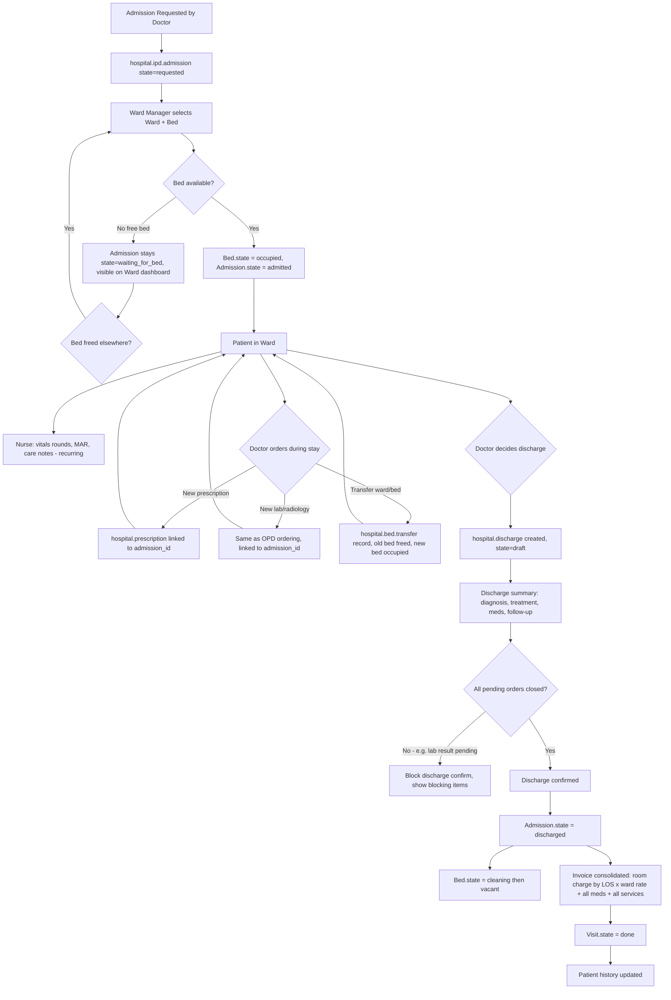
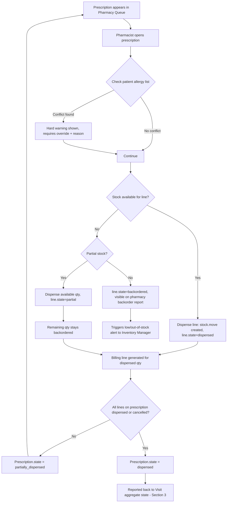
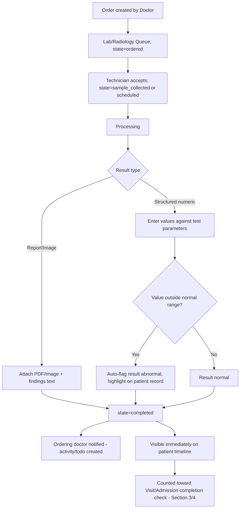

# Phase 3 — Hospital Workflow Analysis

This phase defines every workflow state, transition, edge case, and exception across the patient journey. These diagrams are the contract that Phase 5 (database design — `state` fields, constraints) and Phase 6 (module automation logic) must implement exactly.

---

## 1. Master End-to-End Patient Journey (OPD happy path)

**Key rule:** every box after "Create hospital.visit" reads/writes the *same* `patient_id` and `visit_id` foreign keys. No department creates its own patient or visit record.

---

## 2. Reception → Nurse → Doctor (detailed, with edge cases)

**Edge cases covered:**
- Walk-in with no appointment vs. pre-booked appointment (both converge to the same `waiting_nurse` state; appointment just pre-fills `doctor_id`).
- Patient leaves before being called: Reception can set `Visit.state = cancelled` from any pre-consultation state (cancellation reason required).
- Doctor unavailable mid-day: visit reassignment is a explicit reception action, never silent.
- Abnormal vitals auto-escalate priority — this is the one place nurse data triggers an automatic *business* decision (urgent flag), not just a state transition.

---

## 3. Consultation → Multi-Branch Routing

**Edge cases:**
- A visit can be simultaneously in the Pharmacy queue and Lab queue — `Visit.state = in_progress_multi` is a computed/aggregate state; the *real* per-branch status lives on each sub-record (`prescription.state`, `lab.order.state`). The visit only flips to `billing` when **all** branches report `done` or `cancelled`.
- Doctor can re-open a "done" consultation same-day to add a forgotten order (audit-logged amendment), which re-opens the visit from `billing` back to `in_progress_multi`.
- If a lab/radiology order is cancelled by the ordering doctor before being acted on, it's excluded from the "all branches completed" check.

---

## 4. IPD: Admission → Ward → Discharge

**Edge cases:**
- No bed available at request time: admission is queued (`waiting_for_bed`), visible to ward managers across all wards (not stuck invisibly).
- Discharge is **blocked at the workflow level** (not just a warning) if there are unresolved lab/radiology orders or undispensed prescriptions tied to the admission — Phase 5 will back this with a model-level constraint/validation, not just UI.
- Death-in-care / against-medical-advice (AMA) discharge are discharge *sub-types* (`discharge.type` field), not separate workflows — they still go through the same bed-release and billing-finalization path, with different printed summary templates.
- Bed transfer mid-stay never creates a new admission record — it's a child `hospital.bed.transfer` row under the same `hospital.ipd.admission`, preserving one continuous stay record.

---

## 5. Pharmacy Dispensing Detail (with safety exceptions)

---

## 6. Lab / Radiology Order-to-Result Detail

**Exception:** an order can be **cancelled** by the ordering doctor at any point before `sample_collected`/`scheduled`; once collection/scheduling has happened, cancellation requires a reason and is audit-logged (sample already consumed).

---

## 7. Cross-Cutting Exceptions (apply across all workflows)

| Exception | Handling |
|---|---|
| Patient leaves mid-workflow (LWBS — left without being seen) | Any pre-billing state can transition to `cancelled` with mandatory reason; no invoice generated unless billable services were already rendered (e.g., a lab test already run is still billed even if the patient leaves before doctor follow-up). |
| Wrong patient selected at registration | Visit can be voided (`state=void`) before any clinical data is attached; if clinical data exists, must be corrected via an audited "reassign visit to correct patient" admin action, never a silent delete. |
| Duplicate patient merge | Admin-only wizard merges two `hospital.patient` records (Phase 6), re-pointing all visit/vitals/prescription/lab/admission FKs to the surviving record, fully audit-logged. |
| System/network interruption mid-entry | Odoo's transactional ORM ensures partial writes never commit; no "half-created" visit/prescription states are reachable. |
| Emergency walk-in bypassing queue order | Reception/triage can set `priority=emergency`, which always sorts first in every queue regardless of check-in time. |
| Doctor amends a closed consultation | Allowed same-day only, fully audit-logged, reopens the visit aggregate state as described in Section 3. |
| Death in care | Discharge sub-type `deceased`; skips follow-up instructions section on the printed summary, still finalizes billing and frees the bed. |

---

## Status

Workflow contract complete. Proceeding to Phase 4 — System Architecture.
