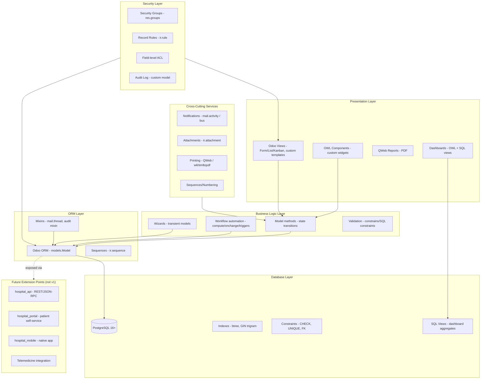
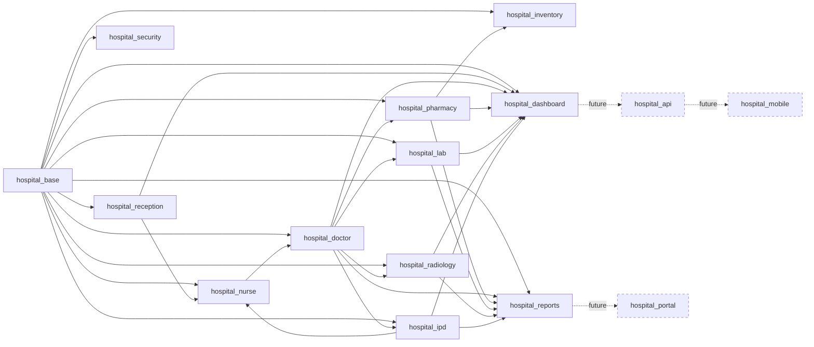
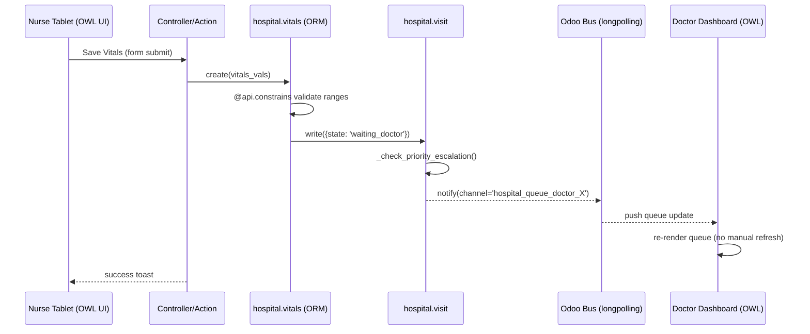
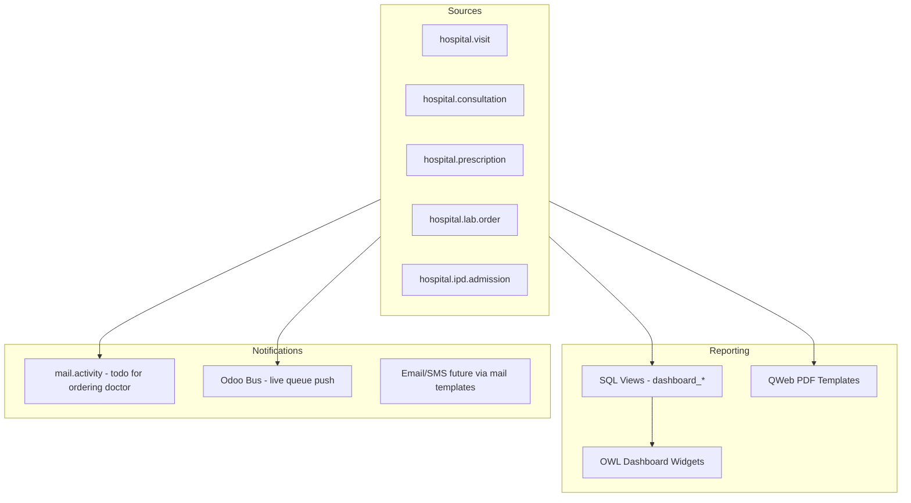
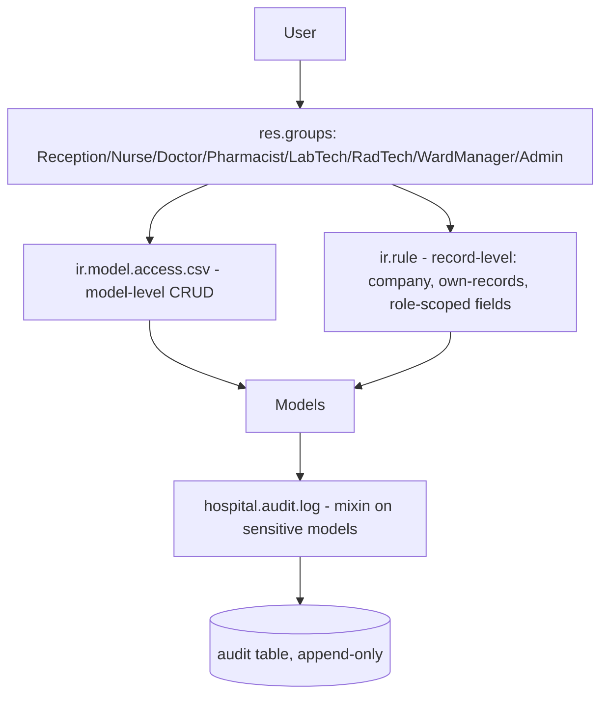

# Phase 4 — System Architecture

**Principle:** zero Odoo core modification. Every capability below is delivered as installable addons under a shared `hospital_*` namespace, depending on Odoo 19 core/Enterprise modules (`base`, `mail`, `stock`, `account`, `web`, `portal`, etc.) the normal way — via `depends` in `__manifest__.py` — never by editing core files.

---

## 1. Layered Architecture Overview

---

## 2. Module Dependency Graph

**Odoo core/Enterprise dependencies used (not modified):** `base`, `mail`, `web`, `stock`, `account`, `hr` (optional, for doctor=employee linkage), `portal` (future), `web_tour` (onboarding), `auth_signup` (future portal).

---

## 3. Runtime Request Flow (example: Nurse submits vitals → Doctor queue updates)

This illustrates the core architectural commitment from Phase 3: **automated transitions happen inside model methods in the same transaction**, and **live UI updates use Odoo's bus/longpolling**, not manual refresh-button workflows.

---

## 4. Reporting & Notification Architecture

---

## 5. Attachment & Printing Architecture

- All clinical attachments (lab PDFs, radiology images, discharge summaries) stored via Odoo's native `ir.attachment`, linked via `res_model`/`res_id` to the owning record (e.g., `hospital.lab.result`) — never a custom file-storage table.
- Printing uses standard QWeb report actions (`ir.actions.report`), rendered server-side to PDF via Odoo's existing wkhtmltopdf pipeline. Custom report templates live in each module's `report/` folder.
- Large attachments (radiology images) rely on Odoo's attachment storage backend configuration (filesystem or S3-compatible, as already supported by Odoo) — no custom storage layer built.

---

## 6. Security Architecture (overview — full detail in Phase 9)

---

## 7. Future Extension Points (designed for now, built later)

| Future capability | How today's architecture enables it without rework |
|---|---|
| **Mobile App** (`hospital_mobile`) | Business logic lives in model methods, not view-bound JS — any future API layer calls the same methods the web UI calls. |
| **Patient Portal** (`hospital_portal`) | Security model (Phase 9) already separates "own visible records" via record rules keyed on `partner_id`, the same mechanism Odoo's native portal uses. |
| **Telemedicine** | `hospital.consultation` model is channel-agnostic (doesn't assume in-person) — a future `consultation_type = 'video'` field and a video-provider integration module can extend it without schema change. |
| **REST/JSON-RPC API** (`hospital_api`) | Odoo's existing external API (XML-RPC/JSON-RPC) already exposes any model with proper ACLs; a dedicated `hospital_api` module would add curated, versioned endpoints/serializers on top, not invent a new transport. |

---

## Status

Architecture defined. Proceeding to Phase 5 — Database Design.
