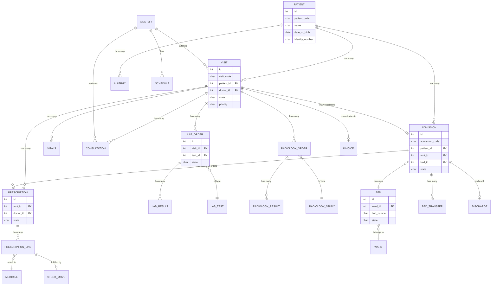

# Phase 5 — Database Design

**Conventions used throughout:**
- All models inherit `hospital.audit.mixin` (adds `create_uid`/`create_date`/`write_uid`/`write_date` — already native to Odoo — plus a linked `hospital.audit.log` trail for sensitive models) and, where chatter is useful, `mail.thread` + `mail.activity.mixin`.
- All `name`/code fields that are human-facing identifiers are generated via `ir.sequence`, never hand-typed, to guarantee uniqueness at scale.
- Every FK is a proper `Many2one` with `ondelete` explicitly set (`restrict` by default for clinical integrity; `cascade` only for true child lines like prescription lines).
- Indexes: `index=True` on every FK used in queue/search filtering, plus PostgreSQL trigram (`pg_trgm`) GIN indexes on free-text search fields (patient name, phone) for sub-second search at 1M+ rows.
- Money fields use `monetary` type with a `currency_id` related field (Odoo standard pattern), never raw `Float` for currency.

---

## 1. Core Identity Models

### 1.1 `hospital.patient`

| Field | Type | Notes |
|---|---|---|
| `patient_code` | Char | Unique, `ir.sequence`-generated (e.g. `PT/00001`), indexed |
| `name` | Char | Required, indexed (trigram GIN for fuzzy search) |
| `date_of_birth` | Date | Required |
| `age` | Integer | Computed from `date_of_birth`, `store=True` |
| `gender` | Selection | male/female/other |
| `blood_group` | Selection | A+/A-/B+/B-/O+/O-/AB+/AB-/unknown |
| `phone` | Char | Indexed (trigram), required |
| `mobile` | Char | Indexed (trigram) |
| `email` | Char | |
| `address_id` | Many2one → `res.partner` | Optional link to a full Odoo partner for billing/portal reuse |
| `identity_type` | Selection | national_id/passport/other |
| `identity_number` | Char | Indexed, used for duplicate-match warning |
| `emergency_contact_name` | Char | |
| `emergency_contact_phone` | Char | |
| `allergy_ids` | One2many → `hospital.patient.allergy` | |
| `chronic_condition_ids` | One2many → `hospital.patient.condition` | |
| `visit_ids` | One2many → `hospital.visit` | inverse of `patient_id` |
| `admission_ids` | One2many → `hospital.ipd.admission` | inverse of `patient_id` |
| `active` | Boolean | default True, standard archive pattern |
| `company_id` | Many2one → `res.company` | multi-branch isolation |

**Constraints:**
- SQL: `UNIQUE(patient_code)`.
- Python `@api.constrains`: `date_of_birth` not in the future.
- Duplicate-match (non-blocking, Phase 3 FR-3): server-side `name_search`/`create` override checks `identity_number` collisions and returns a warning payload — not a hard constraint, by design.

**Indexes:** `name` (GIN trigram), `phone`/`mobile` (GIN trigram), `identity_number` (btree), `patient_code` (unique btree).

---

### 1.2 `hospital.patient.allergy` / `hospital.patient.condition`

Small child tables (`patient_id` FK `ondelete=cascade`, `name`/`severity`/`notes`) — kept separate from `hospital.patient` rather than a comma-field, so pharmacy safety-check queries (Phase 3 §5) can index and join properly instead of parsing text.

---

### 1.3 `hospital.visit` (the spine of the whole system)

| Field | Type | Notes |
|---|---|---|
| `visit_code` | Char | Unique, `ir.sequence` (`VS/00001`) |
| `patient_id` | Many2one → `hospital.patient` | Required, `ondelete=restrict`, indexed |
| `visit_type` | Selection | opd/ipd, required |
| `doctor_id` | Many2one → `hospital.doctor` | indexed (queue filtering) |
| `department_id` | Many2one → `hospital.department` | indexed |
| `priority` | Selection | normal/urgent/emergency, default normal, indexed |
| `state` | Selection | draft / waiting_nurse / waiting_doctor / in_progress_multi / admitted / billing / done / cancelled / void — indexed |
| `checkin_datetime` | Datetime | default now, required |
| `consultation_id` | One2many → `hospital.consultation` | |
| `vitals_ids` | One2many → `hospital.vitals` | |
| `prescription_ids` | One2many → `hospital.prescription` | |
| `lab_order_ids` | One2many → `hospital.lab.order` | |
| `radiology_order_ids` | One2many → `hospital.radiology.order` | |
| `admission_id` | Many2one → `hospital.ipd.admission` | set if escalated to IPD |
| `invoice_id` | Many2one → `account.move` | consolidated billing target |
| `payer_type` | Selection | cash/insurance |
| `cancel_reason` | Text | required if `state=cancelled` |
| `company_id` | Many2one → `res.company` | |

**Constraints:**
- SQL CHECK: `cancel_reason IS NOT NULL OR state != 'cancelled'` (enforced via Python constrains; Odoo doesn't easily express conditional SQL CHECK across enum text, so this is `@api.constrains`, backed by NOT NULL only at the DB level where unconditionally required).
- Computed `state` aggregation logic (Phase 3 §3) lives in a model method `_compute_aggregate_state()`, triggered on write of child records (prescription/lab/radiology) via `inverse`/explicit calls — not a stored compute with fragile `@api.depends` across models with circular references; implemented as direct method calls within each child's state-change method for transactional safety.

**Indexes:** `(state, priority, checkin_datetime)` composite — this is the literal queue-sort query — plus `doctor_id`, `department_id`, `patient_id`.

---

## 2. Reception & Scheduling

### 2.1 `hospital.department`
`name`, `code`, `active`, `company_id`. Simple master.

### 2.2 `hospital.doctor`
| Field | Type | Notes |
|---|---|---|
| `employee_id` | Many2one → `hr.employee` | optional, reuses Odoo HR if installed |
| `user_id` | Many2one → `res.users` | required, login identity |
| `name` | Char related from `user_id` | |
| `department_id` | Many2one → `hospital.department` | |
| `specialization` | Char | |
| `license_number` | Char | |
| `schedule_ids` | One2many → `hospital.doctor.schedule` | |

### 2.3 `hospital.doctor.schedule`
`doctor_id`, `weekday` (Selection 0-6), `start_time` (Float), `end_time` (Float), `max_patients` (Integer) — drives appointment slot availability.

### 2.4 `hospital.appointment` (pre-booked, optional path into `hospital.visit`)
`patient_id`, `doctor_id`, `scheduled_datetime`, `state` (draft/confirmed/checked_in/no_show/cancelled), `visit_id` (Many2one, set once checked in).

---

## 3. Clinical Models

### 3.1 `hospital.vitals`
| Field | Type | Notes |
|---|---|---|
| `visit_id` | Many2one → `hospital.visit` | required, `ondelete=cascade`, indexed |
| `recorded_by` | Many2one → `res.users` | default current user |
| `blood_pressure_systolic` / `_diastolic` | Integer | |
| `pulse_rate` | Integer | |
| `temperature` | Float | Celsius |
| `spo2` | Integer | |
| `respiratory_rate` | Integer | |
| `height_cm` | Float | |
| `weight_kg` | Float | |
| `bmi` | Float | Computed, `store=True`, `depends=[height_cm, weight_kg]` |
| `notes` | Text | |

**Constraints:** `@api.constrains` range sanity checks (e.g., `spo2` 0–100, `pulse_rate` > 0) — clinically-informed bounds reject obvious data-entry errors, not clinical judgment.

### 3.2 `hospital.consultation`
| Field | Type | Notes |
|---|---|---|
| `visit_id` | Many2one → `hospital.visit` | required, indexed |
| `doctor_id` | Many2one → `hospital.doctor` | required, indexed |
| `diagnosis_code` | Char | optional ICD-10 |
| `diagnosis_text` | Text | |
| `clinical_notes` | Text | |
| `outcome` | Selection (multi via related lines, or `Many2many` to an outcome tag) | prescribe/lab/radiology/admit/discharge |
| `state` | Selection | draft/done |
| `amended_from_id` | Many2one → self | tracks same-day amendment (Phase 3 §3 edge case) |

### 3.3 `hospital.medicine` (catalog, integrates with Odoo `product.product`)
Implemented as a **delegation/extension of `product.product`** (via `product.template` inherit, category="Medicine") rather than a brand-new disconnected catalog — this is the key decision that makes pharmacy stock and accounting "free" from Odoo. Adds: `generic_name`, `dosage_form` (tablet/syrup/injection/etc.), `strength`, `requires_prescription` (Boolean), `controlled_substance` (Boolean).

### 3.4 `hospital.prescription`
| Field | Type | Notes |
|---|---|---|
| `visit_id` | Many2one → `hospital.visit` | required, indexed |
| `admission_id` | Many2one → `hospital.ipd.admission` | nullable, set for IPD orders (Phase 3 §4) |
| `doctor_id` | Many2one → `hospital.doctor` | required |
| `state` | Selection | draft/partially_dispensed/dispensed/cancelled, indexed |
| `line_ids` | One2many → `hospital.prescription.line` | |

### 3.5 `hospital.prescription.line`
| Field | Type | Notes |
|---|---|---|
| `prescription_id` | Many2one | `ondelete=cascade`, required |
| `medicine_id` | Many2one → `product.product` | required, indexed |
| `dosage` | Char | e.g. "500mg" |
| `frequency` | Char | e.g. "TID" |
| `duration_days` | Integer | |
| `route` | Selection | oral/IV/IM/topical/other |
| `qty_prescribed` | Float | |
| `qty_dispensed` | Float | default 0 |
| `state` | Selection | pending/dispensed/partial/backordered/cancelled |
| `stock_move_id` | Many2one → `stock.move` | set on dispense, links to real Odoo inventory transaction |

**Constraint:** `qty_dispensed <= qty_prescribed` (`@api.constrains`).

---

## 4. Lab & Radiology

### 4.1 `hospital.lab.test` (catalog) / `hospital.radiology.study` (catalog)
`name`, `code`, `price` (→ links to a `product.product` service for billing reuse), `normal_range_min`/`max` (for lab), `sample_type` (for lab).

### 4.2 `hospital.lab.order`
`visit_id`, `admission_id` (nullable), `doctor_id`, `test_id`, `state` (ordered/sample_collected/processing/completed/cancelled), `priority`, `sample_barcode`, `collected_by`, `collected_at`.

### 4.3 `hospital.lab.result`
`order_id` (Many2one, `ondelete=cascade`), `parameter_name`, `value`, `unit`, `normal_range_min`/`max`, `is_abnormal` (computed Boolean), `attachment_ids` (Many2many → `ir.attachment`), `entered_by`, `entered_at`, `verified_by` (optional second-check workflow).

### 4.4 `hospital.radiology.order` / `hospital.radiology.result`
Mirrors lab structure: `order` has `study_id`, `state` (ordered/scheduled/in_progress/completed/cancelled); `result` has `findings_text`, `attachment_ids`, `reported_by`.

---

## 5. IPD (Inpatient)

### 5.1 `hospital.ward`
`name`, `code`, `ward_type` (general/icu/maternity/etc.), `daily_rate` (Monetary), `bed_ids` (One2many), `company_id`.

### 5.2 `hospital.bed`
| Field | Type | Notes |
|---|---|---|
| `ward_id` | Many2one | required, indexed |
| `bed_number` | Char | required |
| `state` | Selection | vacant/occupied/reserved/cleaning, indexed |
| `current_admission_id` | Many2one → `hospital.ipd.admission` | nullable |

**Constraint (the critical one from Phase 3 FR-33):** SQL partial unique index ensuring **at most one active admission per bed**:
```sql
CREATE UNIQUE INDEX hospital_bed_one_active_admission
ON hospital_ipd_admission (bed_id)
WHERE state = 'admitted';
```
This guarantees the "no double-booked bed" rule at the database level, not just in Python — exactly per the Phase 3 acceptance criterion.

### 5.3 `hospital.ipd.admission`
| Field | Type | Notes |
|---|---|---|
| `admission_code` | Char | unique, sequence |
| `patient_id` | Many2one → `hospital.patient` | required, indexed |
| `visit_id` | Many2one → `hospital.visit` | required |
| `bed_id` | Many2one → `hospital.bed` | nullable until assigned |
| `ward_id` | Many2one (related from bed, stored) | for fast ward-level queries |
| `admitting_doctor_id` | Many2one → `hospital.doctor` | |
| `state` | Selection | requested/waiting_for_bed/admitted/discharged/cancelled, indexed |
| `admission_datetime` | Datetime | |
| `discharge_id` | Many2one → `hospital.discharge` | |
| `transfer_ids` | One2many → `hospital.bed.transfer` | |
| `length_of_stay_days` | Float | computed from admission/discharge datetimes |

### 5.4 `hospital.bed.transfer`
`admission_id`, `from_bed_id`, `to_bed_id`, `transfer_datetime`, `reason`, `transferred_by`.

### 5.5 `hospital.discharge`
`admission_id` (required, unique — one discharge per admission), `discharge_type` (normal/ama/deceased/referred), `discharge_summary` (Text), `follow_up_instructions` (Text), `discharge_medication_ids` (One2many, reuses prescription-line-like structure), `discharged_by`, `discharge_datetime`, `state` (draft/confirmed).

**Constraint (Phase 3 §4 blocking rule):** `@api.constrains` on `state='confirmed'` checks no related `lab.order`/`radiology.order`/`prescription.line` under this admission remains in a non-terminal state; raises `ValidationError` listing the blocking items.

---

## 6. Billing & Inventory (integration, not duplication)

- **Billing:** every billable event writes an `account.move.line` onto a draft `account.move` keyed by `visit_id` (OPD) or `admission_id` (IPD) — using Odoo's native `account.move`/`account.move.line` models directly. No custom invoice table.
- **Inventory:** `hospital.medicine` *is* a `product.product`; dispensing creates a real `stock.move` via Odoo's standard `stock.picking`/`stock.move` flow against a "Pharmacy" warehouse/location. Stock levels, valuation, and reordering are 100% native Odoo Inventory — we only add the clinical dispensing UI and safety checks on top.

---

## 7. Audit & Security Support Models

### 7.1 `hospital.audit.log`
`res_model` (Char), `res_id` (Integer), `user_id`, `action` (create/write/unlink/read-sensitive), `field_changes` (JSON/Text — before/after for tracked fields), `timestamp` — append-only, no `unlink` access for any group (Phase 9 detail).

### 7.2 `hospital.audit.mixin` (abstract)
Provides a `_track_sensitive_fields` hook and `create`/`write` overrides that emit `hospital.audit.log` rows for models that opt in (`hospital.patient`, `hospital.consultation`, `hospital.prescription`, `hospital.ipd.admission`).

---

## 8. Sequences (`ir.sequence`)

| Sequence code | Prefix | Used by |
|---|---|---|
| `hospital.patient` | `PT/` | `hospital.patient.patient_code` |
| `hospital.visit` | `VS/` | `hospital.visit.visit_code` |
| `hospital.admission` | `AD/` | `hospital.ipd.admission.admission_code` |
| `hospital.lab.order` | `LAB/` | `hospital.lab.order.name` |
| `hospital.radiology.order` | `RAD/` | `hospital.radiology.order.name` |
| `hospital.prescription` | `RX/` | `hospital.prescription.name` |

---

## 9. Entity-Relationship Diagram (core spine)



---

## 10. Performance Design Notes (ties to PRD NFR-1/PR-1..5)

- All queue views (`hospital.visit` filtered by `state`/`doctor_id`) are backed by the composite index in §1.3 — no full table scans at 1M rows.
- Dashboard aggregates (Phase 6/8 `hospital_dashboard`) are implemented as PostgreSQL **SQL views** (`_auto = False` Odoo models) for counts like "patients waiting per doctor," "bed occupancy %," "today's revenue" — computed in the database, not pulled into Python and looped.
- Patient name/phone search uses `pg_trgm` GIN indexes (`CREATE EXTENSION pg_trgm`), enabling fast `ILIKE '%term%'` performance Odoo's default btree index cannot provide.
- `hospital.audit.log` is append-only and partitioned-ready (by `timestamp`) if/when volume requires it post-launch — not partitioned in v1 to avoid premature complexity.

---

## Status

Database design complete. Proceeding to Phase 6 — Module Breakdown.
