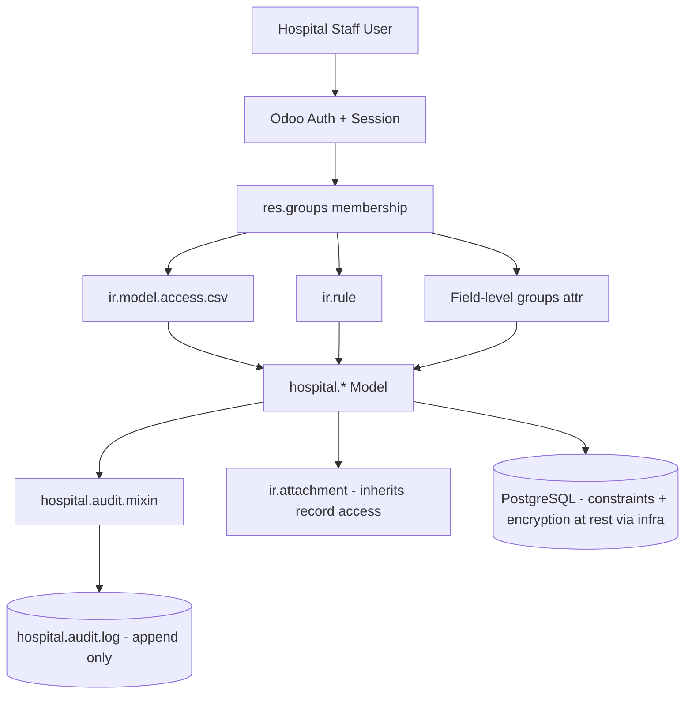

# Phase 9 — Security Design

All security is implemented using Odoo 19's native security framework (`res.groups`, `ir.model.access.csv`, `ir.rule`) — no custom authentication, no bypassing the ORM's security layer, no core modification.

---

## 1. Security Groups (RBAC)

| Group (XML id) | Maps to role | Module owning it |
|---|---|---|
| `group_hospital_reception` | Reception/Front Desk | `hospital_reception` |
| `group_hospital_nurse` | Nurse | `hospital_nurse` |
| `group_hospital_doctor` | Doctor | `hospital_doctor` |
| `group_hospital_pharmacist` | Pharmacist | `hospital_pharmacy` |
| `group_hospital_lab_tech` | Lab Technician | `hospital_lab` |
| `group_hospital_radiology_tech` | Radiology Technician | `hospital_radiology` |
| `group_hospital_ward_manager` | Ward/Bed Manager | `hospital_ipd` |
| `group_hospital_inventory_manager` | Pharmacy/Inventory Manager | `hospital_inventory` |
| `group_hospital_admin` | Hospital Administrator | `hospital_base` |
| `group_hospital_it_admin` | IT/System Administrator (superset, incl. audit log + security config access) | `hospital_security` |

Groups are non-exclusive (a user can hold multiple, e.g., a doctor who is also an admin), following Odoo's standard `res.groups` composability rather than inventing a separate role table.

---

## 2. Model-Level Access (`ir.model.access.csv`)

Per-module CSV grants, following the principle of least privilege:

| Model | Reception | Nurse | Doctor | Pharmacist | Lab Tech | Rad Tech | Ward Mgr | Admin |
|---|---|---|---|---|---|---|---|---|
| `hospital.patient` | CRUD | R, W (limited fields) | R, W | R | R | R | R | CRUD |
| `hospital.visit` | CRUD | R, W | CRUD | R | R | R | R | CRUD |
| `hospital.vitals` | R | CRUD | R | — | — | — | R | CRUD |
| `hospital.consultation` | R | R | CRUD (own) | R (limited) | — | — | — | CRUD |
| `hospital.prescription(.line)` | — | — | CRUD (own) | R, W (dispense fields) | — | — | — | CRUD |
| `hospital.lab.order/result` | — | — | CR (own orders) | — | CRUD | — | — | CRUD |
| `hospital.radiology.order/result` | — | — | CR (own orders) | — | — | CRUD | — | CRUD |
| `hospital.ward/bed/admission` | R | R | CR | — | — | — | CRUD | CRUD |
| `hospital.discharge` | — | R | CRUD (own admissions) | — | — | — | R, W | CRUD |
| `hospital.medicine` (product) | R | — | R | R | — | — | — | CRUD |
| `hospital.audit.log` | — | — | — | — | — | — | — | R only (no W/U/D, even for admin) |

"CRUD" never includes `unlink` for clinical records in production hospital use (Phase 9 §6) except where explicitly noted (e.g., admin correcting a true data-entry mistake via a controlled wizard, never a raw delete).

---

## 3. Record Rules (`ir.rule`)

| Rule | Applies to | Logic |
|---|---|---|
| **Multi-company isolation** | All hospital.* models with `company_id` | `['|', ('company_id', '=', False), ('company_id', 'in', company_ids)]` — standard Odoo multi-company pattern, isolates hospital branches in a chain. |
| **Doctor owns own consultations** | `hospital.consultation` | Doctors can write only where `doctor_id.user_id = uid`; read access to consultations for patients in their own queue is broader (history visibility, Phase 3 FR-15), write is restricted. |
| **Ward manager scoped to assigned wards** (optional, configurable) | `hospital.bed`, `hospital.ipd.admission` | If a hospital configures ward managers per-ward (large hospitals), rule restricts to `ward_id in user.ward_ids`; defaults to all wards for small hospitals (no ward assignment configured = no restriction). |
| **Patient field-level sensitivity** | `hospital.patient` | Implemented via `groups` attribute on individual `<field>` elements in views (e.g., `identity_number` only visible to reception/admin) rather than record rules, since the restriction is field-level not row-level. |
| **Pharmacist limited consultation visibility** | `hospital.consultation` | Pharmacists get read access only to the fields needed for safe dispensing (medicine list, allergy flags) via a restricted view/related fields, not the full diagnosis notes — enforced through a dedicated read-only "pharmacy view" of prescription data rather than direct model-level field ACLs (Odoo's field-level group restriction handles this natively). |

---

## 4. Encryption

- **At rest:** delegated to the PostgreSQL/infrastructure layer (disk encryption, managed DB encryption-at-rest e.g. on Odoo.sh or cloud-managed Postgres) — not reinvented in application code, which would risk introducing custom-crypto bugs.
- **In transit:** HTTPS/TLS enforced at the reverse proxy/load balancer level (standard Odoo deployment practice) — documented as a deployment requirement (Phase 10/DevOps), not an application-code feature.
- **Sensitive field consideration:** national ID/identity numbers are stored as plain indexed text (required for search/dedup, Phase 5) but access-restricted via field-level groups (§3) and covered by audit logging (§6) — full column-level encryption is flagged as a future hardening option if a specific customer's compliance regime demands it, not built speculatively into v1.

---

## 5. Sessions

- Relies entirely on Odoo's native session management (`ir.sessions`, cookie-based session with server-side store).
- Session timeout configured via standard Odoo settings (`base_setup`), recommended hospital default: shorter idle timeout (15–30 min) on shared workstations (reception, nurse station), documented in deployment guide rather than hardcoded — hospitals vary in policy.
- No custom session storage or token scheme introduced.

---

## 6. Audit Logs & Activity Logs

- `hospital.audit.log` (Phase 5 §7.1): append-only, populated via `hospital.audit.mixin` `create`/`write` overrides on `hospital.patient`, `hospital.consultation`, `hospital.prescription`, `hospital.ipd.admission`, and `hospital.discharge`.
- No group — including `group_hospital_admin` — has `unlink` access on `hospital.audit.log` (enforced in `hospital_security`'s `ir.model.access.csv`, zero rows grant unlink=1). This is a deliberate "even the admin can't tamper" design, important for credibility in a compliance-conscious sales conversation.
- Odoo's native `mail.thread` chatter is additionally enabled on `hospital.patient`, `hospital.consultation`, and `hospital.ipd.admission` for human-readable activity history (who changed what, with optional internal notes) — this is a complementary, user-facing log; `hospital.audit.log` is the tamper-resistant compliance-grade log.
- "Who viewed a patient record" (PRD FR-45) is implemented as a lightweight read-audit on the patient `read()` method, throttled (logs once per user per patient per session window, not on every field re-render) to avoid table bloat.

---

## 7. Attachment Security

- All attachments (lab reports, radiology images, discharge summaries) use Odoo's native `ir.attachment` with its existing access-control delegation to the parent record (`res_model`/`res_id`) — a user can only access an attachment if they can access the record it's attached to. No separate ACL system for files.
- No public/unauthenticated attachment URLs are generated for clinical attachments (Odoo's `ir.attachment` access tokens are scoped and require an authenticated session by default for non-public records).

---

## 8. GDPR Readiness

- **Right to access:** Patient Profile screen (Phase 8 §4) already gives a complete view of all data held on a patient — directly supports fulfilling a subject access request.
- **Right to erasure:** v1 supports **anonymization**, not hard deletion, of a patient record (replacing PII fields with redacted placeholders while preserving clinical/billing record integrity required for medical-legal retention) — implemented as an admin-only wizard (`hospital.patient.anonymize.wizard`), fully audit-logged. True deletion is not offered because medical record retention law in most jurisdictions overrides erasure requests; this is documented honestly rather than over-promising "delete my data."
- **Data minimization:** field-level access (§3) ensures roles only see what they need.
- **Consent tracking:** out of v1 scope per PRD §14; flagged as a future field (`hospital.patient.consent_ids`) if a customer's jurisdiction requires explicit consent logging.

---

## 9. HIPAA-Inspired Practices (not a certification claim)

- Minimum necessary access via field-level/group restrictions (§3).
- Full audit trail of access and modification (§6).
- Unique user identification (Odoo's native per-user login, no shared accounts — enforced as a deployment policy recommendation).
- Automatic logoff (session timeout, §5).
- Transmission security (TLS, §4).

These practices mirror HIPAA's Security Rule technical safeguards in spirit; we explicitly do not claim formal HIPAA certification anywhere in product materials, since certification involves organizational/legal processes (BAAs, risk assessments) outside the software itself — consistent with Phase 1/2's scope honesty.

---

## 10. Password Policies & Brute-Force Protection

- Delegates to Odoo's native password policy module (`auth_password_policy` if installed) and built-in login throttling/lockout after repeated failures — not reimplemented.
- Recommended hospital deployment config (documented in Phase 10/DevOps deliverables): minimum 10-character passwords, optional 2FA (`auth_totp`, native to Odoo) enforced for `group_hospital_admin` and `group_hospital_it_admin` at minimum.

---

## 11. CSRF / XSS / SQL Injection Prevention

- **CSRF:** Odoo's native CSRF token system on all forms/controllers — no controller disables CSRF protection without a documented, reviewed reason (e.g., none expected in this product).
- **XSS:** all QWeb templates use auto-escaping `t-esc`/`t-out`; `t-raw` is never used on user-supplied content (clinical notes, patient names, etc.) — only ever on trusted, sanitized, system-generated HTML if absolutely required.
- **SQL Injection:** all database access goes through the Odoo ORM (`self.env['model'].search/read/write`) or parameterized `self.env.cr.execute(query, params)` calls — no raw string interpolation into SQL anywhere in any module, enforced as a hard coding-standard rule (Phase 11).

---

## 12. Security Summary Diagram

---

## Status

Security design complete. Proceeding to Phase 10 — Development Plan.
